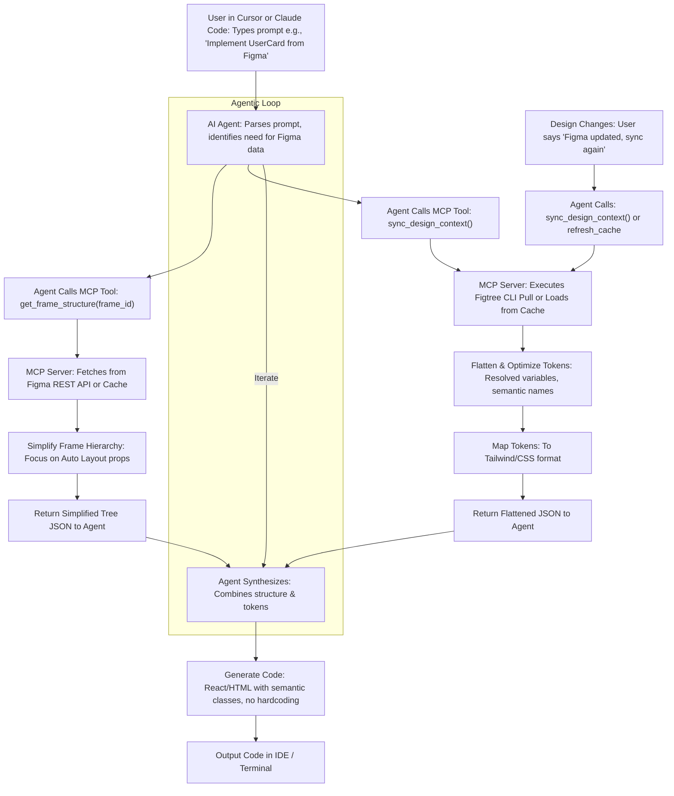
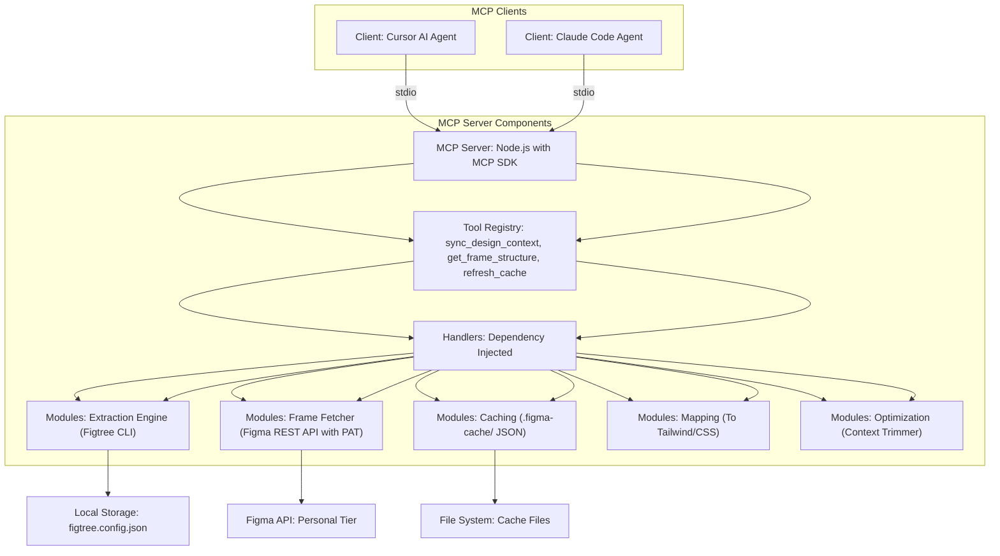
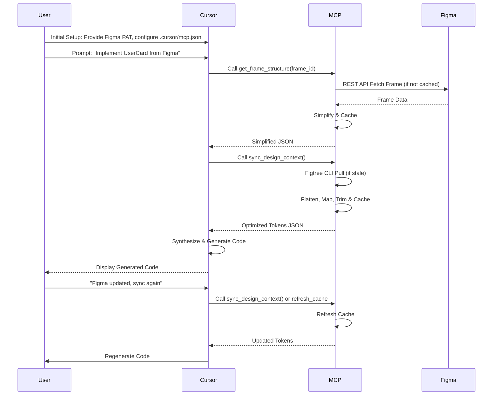
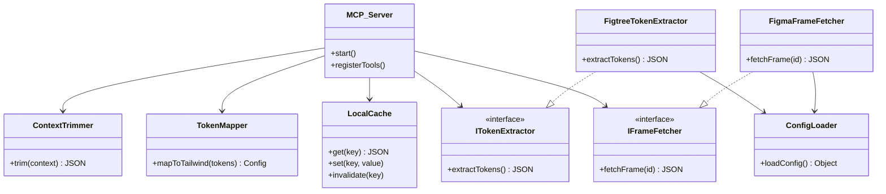

# Figma-Bridge MCP

A Model Context Protocol (MCP) server that bridges Figma designs and AI coding agents (Cursor and Claude Code), enabling agentic UI development for Figma Personal/Starter tier users. The LLM autonomously pulls resolved design tokens and layout structures so generated code uses semantic classes instead of hardcoded hex values.

## Table of Contents

- [Why Figma-Bridge MCP?](#why-figma-bridge-mcp)
- [Supported Clients](#supported-clients)
- [Features](#features)
- [Architecture](#architecture)
  - [High-Level Flow](#high-level-flow)
  - [System Components](#system-components)
  - [Sequence Diagram (Cursor)](#sequence-diagram-cursor)
  - [Sequence Diagram (Claude Code)](#sequence-diagram-claude-code)
  - [Class Diagram](#class-diagram)
- [MCP Tools](#mcp-tools)
- [Getting Started](#getting-started)
  - [Prerequisites](#prerequisites)
  - [Installation](#installation)
  - [Configuration](#configuration)
  - [Running the Server](#running-the-server)
  - [Connecting to Cursor](#connecting-to-cursor)
  - [Connecting to Claude Code](#connecting-to-claude-code)
- [Typical Workflow](#typical-workflow)
  - [Cursor Workflow](#cursor-workflow)
  - [Claude Code Workflow](#claude-code-workflow)
- [Project Structure](#project-structure)
- [Design Principles](#design-principles)
- [Development](#development)
  - [Git Workflow](#git-workflow)
  - [Testing](#testing)
  - [Roadmap](#roadmap)
- [Risks and Mitigations](#risks-and-mitigations)
- [License](#license)

## Why Figma-Bridge MCP?

Developers on Figma's Personal or Starter tier face three recurring pain points when using AI-assisted code generation:

| Problem | Impact |
|---|---|
| **Tier Restrictions** | The official Figma MCP and REST Variables API are gated behind Enterprise/Pro features, locking out Personal/Starter users. |
| **Token Accuracy** | Standard JSON exports provide raw hex codes but lose semantic meaning (e.g., `primary-button-bg`), leading to inconsistent, hardcoded values in generated code. |
| **Manual Friction** | Developers must manually export files or copy-paste CSS, breaking the flow of agentic coding in Cursor and Claude Code. |

Figma-Bridge MCP eliminates all three by providing an MCP server that any compatible AI agent can call directly, fetching resolved, semantically named design tokens and simplified frame structures on demand.

### Success Metrics

- **Zero Hardcoding** -- No raw hex codes in generated output; all values come from synced tokens.
- **< 3 Second Latency** -- Syncing a frame to a code-ready context completes in under three seconds.
- **Reliable Adoption** -- Successful tool calls in both Cursor and Claude Code without errors.

## Supported Clients

Figma-Bridge MCP works with any MCP-compatible AI coding agent. Currently tested and documented for:

| Client | Transport | Configuration |
|---|---|---|
| **Cursor** | stdio | `.cursor/mcp.json` or global Cursor settings |
| **Claude Code** | stdio | `claude mcp add` CLI, `.mcp.json` project file, or `~/.claude.json` |

Both clients communicate with the server over stdio, so the same server binary works for either client with no code changes.

## Features

- **Design Token Extraction** -- Pulls resolved design variables from Figma via [Figtree CLI](https://github.com/nicholasgasior/figtree), flattening and optimizing JSON for LLM consumption.
- **Semantic Token Mapping** -- Maps Figma variables to Tailwind CSS / CSS custom-property formats so generated code uses semantic class names.
- **Frame Structure Fetching** -- Retrieves Figma frame hierarchies via the REST API and simplifies them to Auto Layout properties (padding, gap, alignment) for layout generation.
- **Local Caching** -- Caches token and frame data in `.figma-cache/` to avoid redundant API calls and respect Figma rate limits.
- **Context Trimming** -- Strips redundant metadata (e.g., `transitionNodeID`, `isMask`) to keep LLM context within token limits.
- **Cache Refresh** -- Exposes a `refresh_cache` tool so the agent can re-sync when designs change without restarting the server.
- **Multi-Client Support** -- Works identically with Cursor and Claude Code via the standard MCP stdio transport.

## Architecture

### High-Level Flow



### System Components



### Sequence Diagram (Cursor)



### Sequence Diagram (Claude Code)


### Class Diagram



## MCP Tools

The server exposes three tools that any MCP-compatible agent (Cursor or Claude Code) can invoke:

| Tool | Description | Key Inputs |
|---|---|---|
| `sync_design_context` | Pulls design tokens via Figtree CLI, flattens them into optimized JSON, maps to Tailwind/CSS format, and caches locally. | None (uses configured Figma file) |
| `get_frame_structure` | Fetches a Figma frame by ID via the REST API, simplifies the hierarchy to Auto Layout properties, and returns a code-ready tree. | `frame_id` -- the Figma node ID |
| `refresh_cache` | Invalidates the local cache and forces a fresh sync of tokens and frame data. | None |

## Getting Started

### Prerequisites

- **Node.js** >= 18
- **npm** >= 9
- **Figma Personal Access Token (PAT)** -- generate one at [Figma > Settings > Personal Access Tokens](https://www.figma.com/developers/api#access-tokens)
- **One or both** of the following MCP clients:
  - **Cursor** with MCP support enabled
  - **Claude Code** (Anthropic's CLI agent) -- [installation docs](https://code.claude.com/docs/en)

### Installation

```bash
git clone https://github.com/your-username/figma-bridge-mcp.git
cd figma-bridge-mcp
npm install
```

### Configuration

1. **Set your Figma PAT as an environment variable** (never hardcode it):

```bash
export FIGMA_PAT="your-personal-access-token"
```

Or create a `.env` file (already in `.gitignore`):

```
FIGMA_PAT=your-personal-access-token
```

2. **Create a Figtree config** at `config/figtree.config.json` that maps Figma variable collections to CSS / Tailwind tokens. See the Figtree documentation for the full schema. A minimal example:

```json
{
  "fileId": "YOUR_FIGMA_FILE_ID",
  "collections": [
    {
      "name": "Colors",
      "modes": ["Light", "Dark"],
      "outputFormat": "css"
    }
  ]
}
```

### Running the Server

```bash
npm start
```

The MCP server starts and listens for tool calls over stdio. Both Cursor and Claude Code spawn the server as a child process and communicate over this transport.

### Connecting to Cursor

Add the server to your Cursor MCP configuration (`.cursor/mcp.json` or global settings):

```json
{
  "mcpServers": {
    "figma-bridge": {
      "command": "node",
      "args": ["dist/index.js"],
      "cwd": "/path/to/figma-bridge-mcp",
      "env": {
        "FIGMA_PAT": "your-personal-access-token"
      }
    }
  }
}
```

Once connected, Cursor's AI agent will automatically discover the registered tools (`sync_design_context`, `get_frame_structure`, `refresh_cache`) and invoke them when prompted with Figma-related tasks.

### Connecting to Claude Code

Claude Code supports three ways to register the server. Choose the one that fits your workflow.

**Option A: CLI command (quickest)**

```bash
claude mcp add --transport stdio --env FIGMA_PAT=your-personal-access-token \
  figma-bridge -- node /path/to/figma-bridge-mcp/dist/index.js
```

This registers the server in your local scope (`~/.claude.json`) for the current project. Add `--scope user` to make it available across all projects, or `--scope project` to write a shared `.mcp.json`.

**Option B: Project-scoped `.mcp.json` (team-shareable)**

Create a `.mcp.json` file at the root of your project:

```json
{
  "mcpServers": {
    "figma-bridge": {
      "type": "stdio",
      "command": "node",
      "args": ["/path/to/figma-bridge-mcp/dist/index.js"],
      "env": {
        "FIGMA_PAT": "${FIGMA_PAT}"
      }
    }
  }
}
```

The `${FIGMA_PAT}` syntax expands the environment variable at runtime so the token is never committed. Check this file into version control for team-wide access.

**Option C: JSON config via CLI**

```bash
claude mcp add-json figma-bridge '{
  "type": "stdio",
  "command": "node",
  "args": ["/path/to/figma-bridge-mcp/dist/index.js"],
  "env": { "FIGMA_PAT": "your-personal-access-token" }
}'
```

**Verify the server is registered:**

```bash
claude mcp list
claude mcp get figma-bridge
```

Inside a Claude Code session, use `/mcp` to check server status and tool availability.

## Typical Workflow

### Cursor Workflow

1. Open Cursor and ensure the MCP server is configured in `.cursor/mcp.json`.
2. Prompt the agent: *"Implement the UserCard component from Figma frame `12:345`"*.
3. The agent calls `get_frame_structure("12:345")` to retrieve the simplified layout tree.
4. The agent calls `sync_design_context()` to pull current design tokens.
5. The agent synthesizes both responses and generates React/HTML code using semantic Tailwind classes.
6. When the Figma design is updated, prompt: *"Figma updated, sync again"* -- the agent calls `refresh_cache` and regenerates.

### Claude Code Workflow

1. Open a terminal in your project directory.
2. Start Claude Code: `claude`
3. Prompt the agent: *"Implement the UserCard component from Figma frame `12:345`"*.
4. Claude Code calls `get_frame_structure("12:345")` and `sync_design_context()` via the registered MCP server.
5. The agent synthesizes the responses, generates code, and writes it directly to your project files.
6. When the Figma design is updated, prompt: *"Figma updated, sync again"* -- the agent calls `refresh_cache` and regenerates.

The tool calls and responses are identical regardless of the client; only the initial setup differs.

## Project Structure

```
figma-bridge-mcp/
├── config/
│   └── figtree.config.json        # Figtree variable-mapping configuration
├── docs/
│   ├── PRD.md                     # Product Requirements Document
│   └── DIAGRAMS.md                # Architecture and flow diagrams
├── src/
│   ├── index.ts                   # Entry point
│   ├── interfaces/
│   │   ├── ITokenExtractor.ts     # Token extraction contract
│   │   └── IFrameFetcher.ts       # Frame fetching contract
│   ├── modules/
│   │   ├── extraction/
│   │   │   ├── FigtreeTokenExtractor.ts
│   │   │   └── FigmaFrameFetcher.ts
│   │   ├── caching/
│   │   │   └── LocalCache.ts
│   │   ├── mapping/
│   │   │   └── TokenMapper.ts
│   │   ├── optimization/
│   │   │   └── ContextTrimmer.ts
│   │   └── config/
│   │       └── index.ts           # Config loader (PAT, figtree config)
│   └── server/
│       └── index.ts               # MCP server setup and tool registration
├── .figma-cache/                  # Local cache (git-ignored)
├── .mcp.json                      # Claude Code project-scoped MCP config (optional, team-shareable)
├── .env.example                   # Environment variable template
├── .gitignore
├── jest.config.ts
├── tsconfig.json
├── package.json
├── LICENSE
└── README.md
```

## Design Principles

The codebase follows SOLID principles and a modular architecture:

| Principle | Application |
|---|---|
| **Single Responsibility** | Each module handles one concern -- extraction, caching, mapping, optimization, or server transport are all separate. |
| **Open/Closed** | The `ITokenExtractor` and `IFrameFetcher` interfaces allow swapping implementations (e.g., a mock extractor for tests) without modifying consumers. |
| **Liskov Substitution** | Any class implementing `ITokenExtractor` is interchangeable (e.g., `FigtreeTokenExtractor` can be replaced with a mock). |
| **Interface Segregation** | Token syncing and frame fetching are separate interfaces rather than one monolithic service contract. |
| **Dependency Inversion** | The MCP server depends on abstractions (`ITokenExtractor`, `IFrameFetcher`); concrete implementations are injected via constructors. |

The server is **client-agnostic by design**. It uses the standard MCP stdio transport, so any compliant client (Cursor, Claude Code, or future agents) can connect without changes to the server code.

All public classes, functions, and methods use JSDoc documentation with `@param`, `@returns`, `@throws`, and `@example` annotations. Single-line comments are avoided in favor of structured documentation.

## Development

### Git Workflow

This project uses a feature-branch workflow with semantic commits:

1. Branch from `main`: `git checkout -b feature/your-feature-name`
2. Write specs/tests first (Jest), then implement.
3. Commit granularly with semantic prefixes: `feat:`, `fix:`, `docs:`, `test:`, `refactor:`
4. Push branch, open a PR linking to the relevant user story.
5. Merge after review and all tests pass.

### Testing

Tests use Jest with `ts-jest`. The strategy covers three layers:

| Layer | Scope | Target Coverage |
|---|---|---|
| **Unit** | Individual modules (extractor, mapper, cache, trimmer) | 80%+ |
| **Integration** | Module interactions (extraction + caching, mapping + trimming) | Key paths |
| **End-to-End** | Full tool-call simulation (MCP call through to response) for both Cursor and Claude Code | Critical workflows |

```bash
npm test              # Run all tests
npm run test:watch    # Watch mode
npm run test:coverage # Coverage report
```

### Roadmap

| Phase | Scope | Estimated Duration |
|---|---|---|
| **Phase 1** | Project setup and configuration (Epic 1) | 1 week |
| **Phase 2** | Design token extraction, syncing, and frame fetching (Epics 2-3) | 2 weeks |
| **Phase 3** | MCP server development and tool registration (Epic 4) | 1 week |
| **Phase 4** | Optimization, context trimming, and cache refresh (Epic 5) | 1 week |

See [`docs/PRD.md`](docs/PRD.md) for the full breakdown of epics, user stories, feature branches, and commit plans.

## Risks and Mitigations

| Risk | Mitigation |
|---|---|
| **Figma API changes** | All Figma interactions go through abstraction interfaces (`ITokenExtractor`, `IFrameFetcher`), making implementations swappable. |
| **Rate limits** | Aggressive local caching in `.figma-cache/` with timestamp-based invalidation minimizes API calls. |
| **PAT security** | The Personal Access Token is loaded exclusively from environment variables -- never committed or stored in config files. Claude Code's `.mcp.json` supports `${FIGMA_PAT}` expansion so the token stays in the environment. |
| **Client compatibility** | The server uses the standard MCP stdio transport, avoiding client-specific APIs. Both Cursor and Claude Code are tested. |

## License

This project is licensed under the MIT License. See [LICENSE](LICENSE) for details.

Copyright (c) 2026 Tom Tarpey
