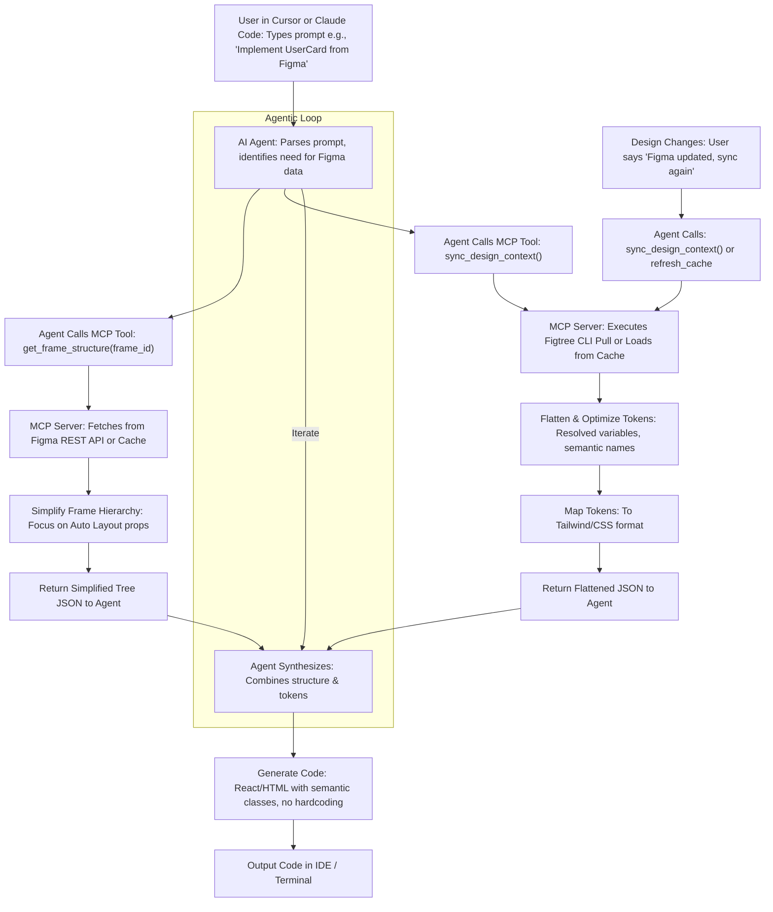
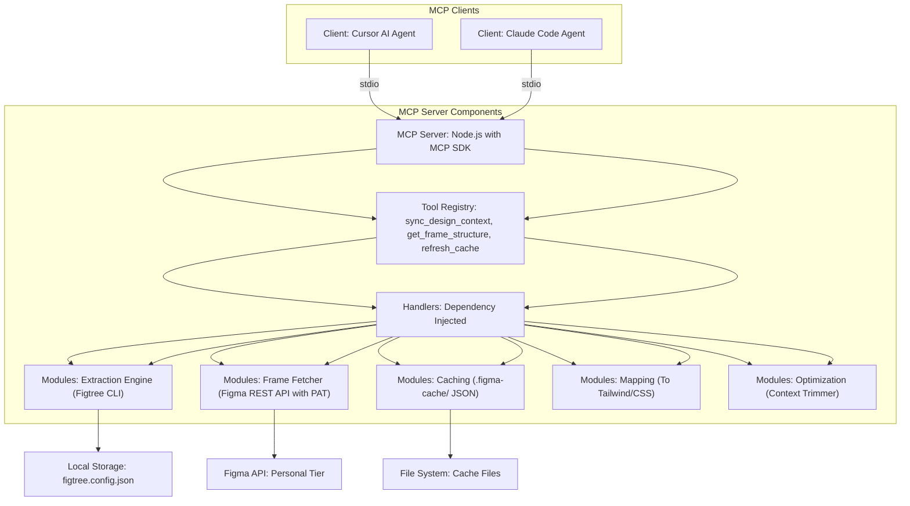
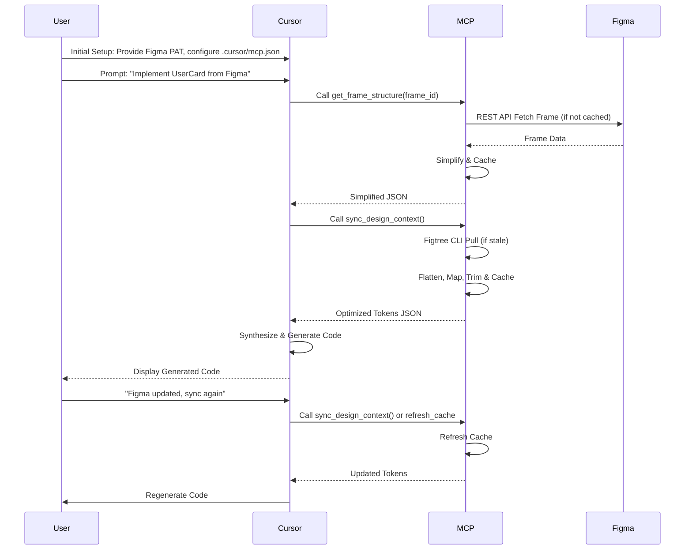
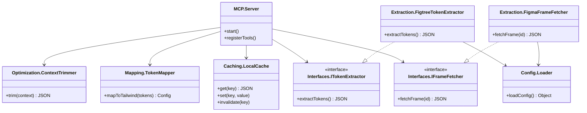

# Diagrams

```mermaid
flowchart TD
    A["User in Cursor or Claude Code: Types prompt e.g., 'Implement UserCard from Figma'"] --> B["AI Agent: Parses prompt, identifies need for Figma data"]
    B --> C["Agent Calls MCP Tool: get_frame_structure(frame_id)"]
    C --> D["MCP Server: Fetches from Figma REST API or Cache"]
    D --> E["Simplify Frame Hierarchy: Focus on Auto Layout props"]
    E --> F["Return Simplified Tree JSON to Agent"]
    B --> G["Agent Calls MCP Tool: sync_design_context()"]
    G --> H["MCP Server: Executes Figtree CLI Pull or Loads from Cache"]
    H --> I["Flatten & Optimize Tokens: Resolved variables, semantic names"]
    I --> J["Map Tokens: To Tailwind/CSS format"]
    J --> K["Return Flattened JSON to Agent"]
    F --> L["Agent Synthesizes: Combines structure & tokens"]
    K --> L
    L --> M["Generate Code: React/HTML with semantic classes, no hardcoding"]
    M --> N["Output Code in IDE / Terminal"]
    O["Design Changes: User says 'Figma updated, sync again'"] --> P["Agent Calls: sync_design_context() or refresh_cache"]
    P --> H
    subgraph "Agentic Loop"
        B -->|Iterate| L
    end
```
-----------------

```mermaid
flowchart TD
    A1["Client: Cursor AI Agent"] -->|"stdio"| B["MCP Server: Node.js with MCP SDK"]
    A2["Client: Claude Code Agent"] -->|"stdio"| B
    B --> C["Tool Registry: sync_design_context, get_frame_structure, refresh_cache"]
    C --> D["Handlers: Dependency Injected"]
    D --> E["Modules: Extraction Engine (Figtree CLI)"]
    D --> F["Modules: Frame Fetcher (Figma REST API with PAT)"]
    D --> G["Modules: Caching (.figma-cache/ JSON)"]
    D --> H["Modules: Mapping (To Tailwind/CSS)"]
    D --> I["Modules: Optimization (Context Trimmer)"]
    E --> J["Local Storage: figtree.config.json"]
    F --> K["Figma API: Personal Tier"]
    G --> L["File System: Cache Files"]
    subgraph "MCP Server Components"
        B --> C --> D --> E
        D --> F
        D --> G
        D --> H
        D --> I
    end
    subgraph "MCP Clients"
        A1
        A2
    end
```

--------------------

```mermaid
sequenceDiagram
    participant User
    participant Cursor
    participant MCP
    participant Figma
    User->>Cursor: Initial Setup: Provide Figma PAT, configure .cursor/mcp.json
    User->>Cursor: Prompt: "Implement UserCard from Figma"
    Cursor->>MCP: Call get_frame_structure(frame_id)
    MCP->>Figma: REST API Fetch Frame (if not cached)
    Figma-->>MCP: Frame Data
    MCP->>MCP: Simplify & Cache
    MCP-->>Cursor: Simplified JSON
    Cursor->>MCP: Call sync_design_context()
    MCP->>MCP: Figtree CLI Pull (if stale)
    MCP->>MCP: Flatten, Map, Trim & Cache
    MCP-->>Cursor: Optimized Tokens JSON
    Cursor->>Cursor: Synthesize & Generate Code
    Cursor-->>User: Display Generated Code
    User->>Cursor: "Figma updated, sync again"
    Cursor->>MCP: Call sync_design_context() or refresh_cache
    MCP->>MCP: Refresh Cache
    MCP-->>Cursor: Updated Tokens
    Cursor->>User: Regenerate Code
```

-------------------

```mermaid
sequenceDiagram
    participant User
    participant ClaudeCode as Claude Code
    participant MCP
    participant Figma
    User->>ClaudeCode: Initial Setup: claude mcp add figma-bridge, set FIGMA_PAT
    User->>ClaudeCode: Prompt: "Implement UserCard from Figma"
    ClaudeCode->>MCP: Call get_frame_structure(frame_id)
    MCP->>Figma: REST API Fetch Frame (if not cached)
    Figma-->>MCP: Frame Data
    MCP->>MCP: Simplify & Cache
    MCP-->>ClaudeCode: Simplified JSON
    ClaudeCode->>MCP: Call sync_design_context()
    MCP->>MCP: Figtree CLI Pull (if stale)
    MCP->>MCP: Flatten, Map, Trim & Cache
    MCP-->>ClaudeCode: Optimized Tokens JSON
    ClaudeCode->>ClaudeCode: Synthesize & Generate Code
    ClaudeCode-->>User: Display Generated Code
    User->>ClaudeCode: "Figma updated, sync again"
    ClaudeCode->>MCP: Call sync_design_context() or refresh_cache
    MCP->>MCP: Refresh Cache
    MCP-->>ClaudeCode: Updated Tokens
    ClaudeCode->>User: Regenerate Code
```

-------------------

```mermaid
classDiagram
    class MCP.Server {
        +start()
        +registerTools()
    }
    class Interfaces.ITokenExtractor {
        <<interface>>
        +extractTokens() JSON
    }
    class Extraction.FigtreeTokenExtractor {
        +extractTokens() JSON
    }
    class Interfaces.IFrameFetcher {
        <<interface>>
        +fetchFrame(id) JSON
    }
    class Extraction.FigmaFrameFetcher {
        +fetchFrame(id) JSON
    }
    class Caching.LocalCache {
        +get(key) JSON
        +set(key, value)
        +invalidate(key)
    }
    class Mapping.TokenMapper {
        +mapToTailwind(tokens) Config
    }
    class Optimization.ContextTrimmer {
        +trim(context) JSON
    }
    class Config.Loader {
        +loadConfig() Object
    }
    MCP.Server --> Interfaces.ITokenExtractor
    MCP.Server --> Interfaces.IFrameFetcher
    MCP.Server --> Caching.LocalCache
    MCP.Server --> Mapping.TokenMapper
    MCP.Server --> Optimization.ContextTrimmer
    Extraction.FigtreeTokenExtractor ..|> Interfaces.ITokenExtractor
    Extraction.FigmaFrameFetcher ..|> Interfaces.IFrameFetcher
    Extraction.FigtreeTokenExtractor --> Config.Loader
    Extraction.FigmaFrameFetcher --> Config.Loader
```
